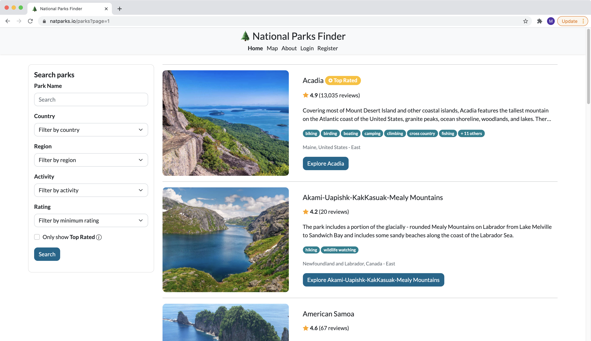
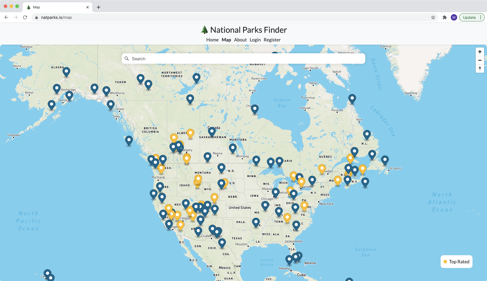
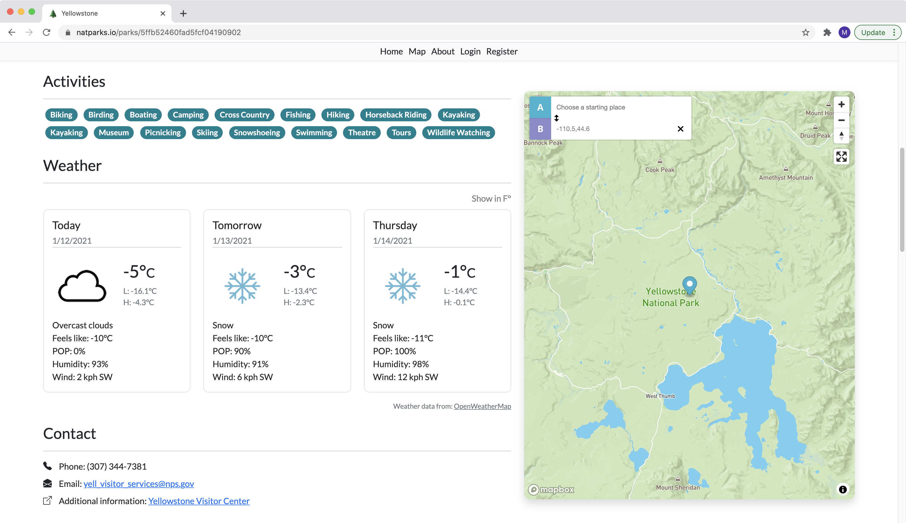
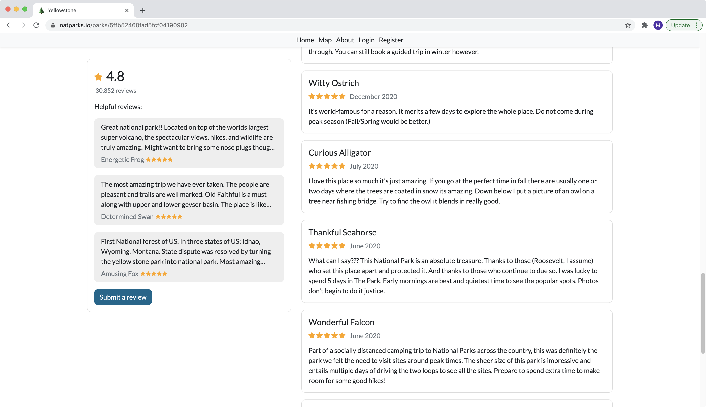
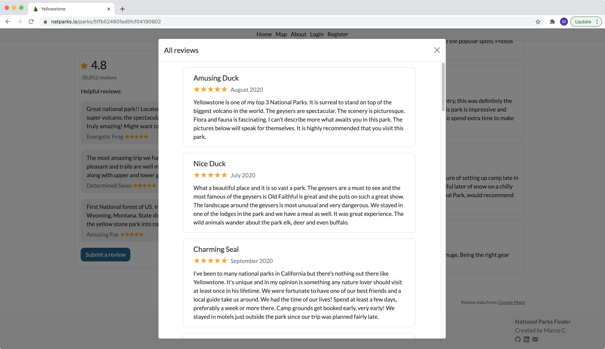

# National_Parks_Finder

Check out the live website here: [https://www.natparks.io/](https://www.natparks.io/)

## About the Project

As I was trying to browse National Parks to visit in the future, I found that there wasn't a standalone website that clearly and concisely showed all National Parks and relevant information about each one. That was what led me to build National Parks Finder, website that lets users easily search and filter for National Parks in Canada and the US, and provides helpful information and links about each park.

Website features:
* Description, reviews, photos, available activities, map/directions, weather, contact information, and visitor center links for all 111 National Parks in Canada and the US. Note: Available activities obtained Parks Canada/US National Park Service, reviews and ratings obtained from Google Maps
* Search parks by name, and filter by country, region, activity, and rating 
* Register and log in to post reviews and photos (as well as delete posted reviews)
* View all National Parks on a map to easily find parks by region
* Responsive pages

# Some screenshots

Home page:

  <kbd>
    
  </kbd>

Filtering for National Parks in the Western US that have hiking as an available activity, and are rated 4.5 stars or higher: 

  <kbd>
    
  </kbd>

Map view of all National Parks, where golden pins denote Top Rated parks:

  <kbd>
    
  </kbd>

Details page of a particular park:

  <kbd>
    
  </kbd>

  <kbd>
    
  </kbd>

  <kbd>
    
  </kbd>

Reviews for a particular park:

  <kbd>
    
  </kbd>

  <kbd>
    
  </kbd>

Log in and register pages (my personal favorite):

  <kbd>
    
  </kbd>

  <kbd>
    
  </kbd>

## Technical details

Design:
* Model-view-controller design
* RESTful server side architecture

Frontend:
* HTML with EJS
* CSS with Bootstrap
* JavaScript

Backend: 
* MongoDB with Mongoose
* Express
* NodeJS

Deployment + Analytics:
* Heroku 
* Google Analytics

#### Thanks for checking out my project! :wave: